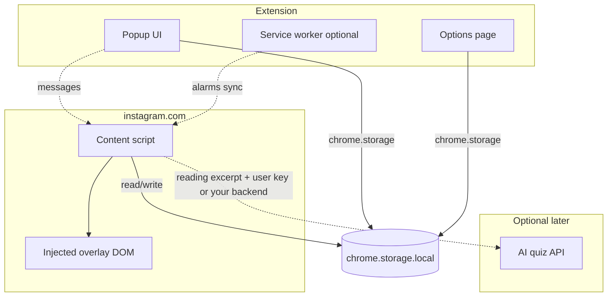
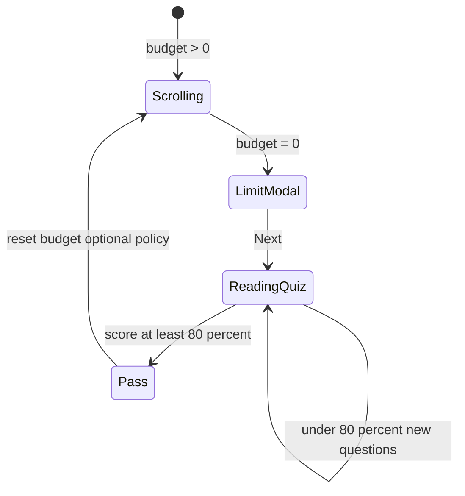

# Scroll Companion — Project plan & architecture

## Product summary

Chrome extension that limits doomscrolling on **Instagram Reels (desktop)**. While scrolling, a **visible budget** counts down; a **plant companion** reflects intensity. When the budget hits zero, scrolling is **blocked by a full-screen flow**: message → **read text from a Project Gutenberg work** → **AI-generated quiz** (80% = 4/5 to pass) → **resume** or retry with new questions until pass.

**User-configurable:** scroll time limit before interruption, **reading preferences** (lookup by **title**, **author**, **subjects** — and optional fields like language / reading ease) to discover and load Gutenberg text, **today’s reading** selection, (future) which sites/apps to affect.

**Popup (toolbar):** reading goal progress (minutes read vs goal), monthly streak calendar, **Gutenberg lookup** (search/filter by title, author, subjects), results list, **load text** for the chosen work, pick **today’s reading**.

**On Instagram (before limit):** a **progress bar fixed at the top** of the viewport that **shrinks** as the scroll budget runs down (remaining time going to zero), plus a **bottom-left** plant companion (4 PNG stages, wilting over the session). **No** speech-bubble timer for the budget—only the bar + plant.

**At limit:** “Time Limit Reached” + wilted plant + short doomscroll copy → Next → reading + quiz at bottom.

**Quiz:** at least 80% → success → return to Reels; under 80% → failure → regenerate questions until pass.

---

## Design tokens

**Color scheme**

| Role        | Hex     |
|------------|---------|
| Heading 1  | `#1b4332` |
| Heading 2  | `#2d6a4f` |
| Heading 3  | `#40916c` |
| Primary    | White   |
| Secondary  | `#95d5b2` |

**Font:** **Inter** everywhere; use **weight** (and size) to separate hierarchy, not different families.

| Use              | Weight | Notes                                      |
|-----------------|--------|--------------------------------------------|
| Heading 1       | 700    | Bold; largest size; optional slight negative letter-spacing |
| Heading 2       | 600    | Semibold                                   |
| Heading 3       | 600    | Semibold; smaller than H2                 |
| Body            | 400    | Regular for paragraphs and long reading   |
| UI labels / nav | 500    | Medium for list titles, form labels       |
| Buttons         | 500–600 | Medium or semibold; pick one and stay consistent |
| Caption / meta  | 400    | Regular at reduced size (streak dates, hints) |

Load Inter in the extension via **bundled `.woff2`** files (recommended: no runtime dependency on Google Fonts in the manifest) or a single `fonts.googleapis.com` stylesheet if you add the needed **host permission** and are fine with a network fetch on popup/options open.

**Must-have UI**

- **Top progress / timeout bar** — fixed along the top of the page; width (or fill) reflects **remaining** budget and decreases as the user scrolls toward the limit (same ratio as `remaining / limit` in Timer model).
- **Four plant stage images** (PNG assets), **bottom-left**, mapped to session intensity / quartiles of budget used.

---

## Pages & surfaces

| Surface | Role |
|--------|------|
| **Extension popup** | Dashboard: goal vs minutes read, streak month view, **Gutenberg discovery** (title / author / subjects), results + **load text**, **today’s reading** selector. |
| **Options page** (recommended) | Time limit, future “sites to block,” storage-heavy settings; keeps popup light. |
| **Instagram content overlay** | **Top** progress bar, **bottom-left** plant, full-screen interrupt (limit → read → quiz → success/fail). |

---

## Design architecture

### High-level (Manifest V3)



**Current codebase:** `manifest.json` + `content.js` + `overlay.css` — content script only, `storage` + Instagram `host_permissions`. Architecture below extends this in phases.

### Responsibilities

| Layer | Responsibility |
|-------|----------------|
| **Content script (`content.js`)** | URL gate (Reels path only if desired), **scroll-budget timer** (only count “active” Reels scrolling), inject overlay, **block interaction** while interrupt is open, render **top bar** + **bottom-left plant** + modal flow. |
| **Popup** | Dashboard, **Gutenberg lookup & load**, streak; sends **runtime messages** to content script if live refresh needed. |
| **Options** | Limits, toggles, API key storage (if client-side AI), site list later. |
| **Service worker** (optional) | `chrome.alarms` for day rollover (streak), or sync settings; not required for v1 if all state is tab-local + `storage`. |
| **Storage (`chrome.storage.local`)** | **MVP:** all persisted state here: **reading prefs**, **catalog / search result cache**, **loaded work text** (bounded excerpt or slice), **today’s reading** id + date, quiz state, streak/goal aggregates. |

### Timer & “active scrolling” model

- **Budget:** configurable duration (ms), decremented only while:
  - document visible,
  - hostname matches allowed list (start: `instagram.com`),
  - optionally: pathname includes Reels (`/reels/`),
  - user activity heuristic (scroll / pointer / focus on video area) within a short idle window — align with your existing `lastActivity` idea but tune thresholds for Reels.
- **Plant stages:** map `elapsed / limit` to 4 discrete thresholds (e.g. 0–25%, 25–50%, …); **position: bottom-left** of the viewport.
- **Bar:** same `remaining / limit` ratio as the budget; **position: fixed top** of the viewport; visually encodes **time left** shrinking toward empty at limit.

### Interrupt & gating flow



**Policy choices to lock in implementation:**

- **After pass:** reset timer to full budget vs partial vs require leaving Reels — document in code as a constant.
- **While modal open:** `pointer-events` + overlay on `document.body` or high z-index root; optionally pause video elements.

### Project Gutenberg & reading

- **Source:** Reading material comes from **Project Gutenberg** (public domain texts). **No user PDF upload** for MVP — users **find** what to read via **title**, **author**, and **subjects** (and optional filters such as language or reading ease), then **load** the text into the extension.
- **Work records:** Shape is along the lines of `{ id, title, author, subjects, language, download_count, text, gutenberg_url, reading_ease }` — where `text` may be a **bounded excerpt** you attach for MVP (or filled after fetch). **Quiz and interrupt UI** consume this **plain text** (chunked to token limits for AI).
- **Discovery in popup:** Search/filter UI writes **`readingPrefs`** (e.g. title substring, author, subject tags); run **catalog search** against a **bundled work index**, **shipped JSON slice**, or a **small backend** you control that returns matching rows. On **select**, **load** `text` into storage (fetch if `text` is loaded lazily from `gutenberg_url` — see policy note below).
- **MVP storage:** Keep **everything in `chrome.storage.local`**: prefs, last results cache, **active reading** (id + title + excerpt `text` + url metadata), and daily pointers. Stay within **~10 MB total**; cap excerpt length so many sessions fit.
- **Gutenberg access:** Respect **[Gutenberg’s automated access / robot policy](https://www.gutenberg.org/policy/robot_access.html)**. Prefer **bundled excerpts**, **one-shot fetch when the user picks a work**, or **your HTTPS mirror** of allowed texts — do not crawl the full site from every install.
- **“Today’s reading”:** `activeGutenbergId` (or `id`) + `activeDate` + cached `text` slice for the interrupt + quiz pipeline (replaces “today’s PDF”).

### Quiz generation (AI)

- **Input:** excerpt from **today’s loaded Gutenberg text** (chunk by token limit).
- **Output:** 5 MCQs with 4 choices each, JSON schema validated in code.
- **Where it runs:**
  - **Preferred for keys:** small **backend** you control so the API key never ships in the extension; extension calls your HTTPS endpoint with `readingText` or `chunkId`.
  - **MVP:** user-supplied API key in options + `fetch` from content script or popup (key in storage) — acceptable for personal use; document risk.
- **Retry path:** on fail (under 80%), new call with same or next chunk; avoid duplicate question IDs.

### Data model (sketch)

```text
settings: { scrollLimitMs, goalMinutesPerDay, aiProvider?, apiKeyEnc? }
readingPrefs: { titleQuery?, author?, subjects? }   // popup filters for discovery
catalogCache: [{ id, title, author, subjects, language?, download_count?, text?, gutenberg_url?, reading_ease? }]  // last search results or bundled slice
activeReading: { id, title, author, text, gutenberg_url?, activeDateISO } | null  // today’s loaded excerpt + metadata
daily: { dateISO, activeGutenbergId, minutesRead, quizAttempts }
session: { budgetRemainingMs, lastTick }
streak: { lastQualifiedDate, monthSnapshot }
```

Exact shapes can evolve; keep **version** field in storage root for migrations.

### Permissions roadmap

| Permission | Use |
|------------|-----|
| `storage` | Settings, **Gutenberg prefs + cached text + metadata**, streak, quiz/daily state. |
| `host_permissions` `*://*.instagram.com/*` | Content script (current). |
| `host_permissions` (add as needed) | e.g. `*://*.gutenberg.org/*` or your **catalog/text mirror** only if the popup/content script **fetches** remote text (keep list minimal). |
| `activeTab` | Optional: if popup triggers actions on current tab. |
| Future sites | Add hosts or optional `<all_urls>` with strong UX justification. |

### Security & privacy

- Loaded reading text stays **local** in `chrome.storage.local` until you explicitly send an excerpt to an AI endpoint; state that in UI.
- If using remote AI: **minimize** text sent (single chunk), no cookies from IG in that request.
- Sanitize any **HTML** injected into overlay; prefer `textContent` + DOM APIs over raw `innerHTML` for user/AI strings.

### Testing strategy (lightweight)

- Manual: load unpacked, Reels URL, top progress bar, modal, quiz pass/fail.
- Later: unit tests for budget math, streak date boundaries, quiz score.

---

## Implementation phases

**Phase 0 — Foundation (align with spec)**  
Remove random intervention; **storage-driven budget**; **top progress bar** + **bottom-left** four-stage plant (no bubble timer); fix content-script tick/update bugs; optional Reels-only URL gate.

**Phase 1 — Popup dashboard**  
Goal minutes, minutes read today, month streak grid, **Gutenberg lookup** (title / author / subjects), results list, **load text**, **today’s reading** selector; persist to `chrome.storage`.

**Phase 2 — Reading pipeline (Gutenberg)**  
Resolve prefs → catalog search → **load** work `text` (excerpt or fetch), chunking for AI, **today’s reading** binding (`activeGutenbergId` + date + cached `text`). **MVP:** prefs + results + active excerpt in **`chrome.storage.local`** only (see **Project Gutenberg & reading**).

**Phase 3 — Quiz + AI**  
Generate 5 questions, render in overlay, score 4/5 gate, fail → regenerate, success → dismiss overlay and reset budget.

**Phase 4 — Options & polish**  
Time limit UI, copy for doomscroll message, typography per design tokens, optional service worker for midnight rollover.

---

## Implementation checklist (TODO)

Checklist is **only** what the sections above require, in dependency order. Current code has a placeholder companion + **speech bubble** + random modal; the spec replaces the bubble with a **top bar** and ties the interrupt to **budget = 0**.

### Phase 0 — Instagram overlay & budget

1. **Storage** — Read/write `settings` (`scrollLimitMs`, `storageVersion`, optional `reelsOnly`) and session/budget fields per **Data model (sketch)**; use defaults until Options exists. **MVP:** only **`chrome.storage.local`**; initialize missing keys (`catalogCache: []`, `activeReading: null`, `readingPrefs: {}`, etc.) so Phase 1+ can add Gutenberg state without a migration.
2. **Remove random intervention** — Delete time-random `scheduleIntervention`; show limit UI only when **budget reaches 0** (**Interrupt & gating flow**).
3. **Budget tick** — Decrement remaining time only under **Timer & “active scrolling” model** (visibility, host, optional `/reels/`, activity window).
4. **Top progress bar** — Inject a fixed **top-of-viewport** track; inner fill or width = `remaining / limit`, updating every tick so the bar **runs down** to limit (**Must-have UI**, same ratio as timer model).
5. **Bottom-left plant** — Four PNGs via `web_accessible_resources`; stage index from quartiles of `elapsed / limit` (**Product summary**, **Must-have UI**).
6. **Remove timer bubble** — Drop `scroll-bubble` (or equivalent) as the primary budget UI; optional tiny caption later in Phase 4 only if needed.
7. **Limit screen** — Full-screen overlay blocking the page: “Time Limit Reached,” **wilted** plant asset, doomscroll copy, **Next** (spec: **At limit**).
8. **Policy constant** — Encode and document **after-pass** behavior (**Interrupt & gating flow** — policy choices); stub success path to dismiss + reset budget until quiz exists.
9. **Robustness** — Single ordered tick path (no use-before-init on DOM refs); high `z-index` + **pointer blocking** while interrupt open (same policy subsection).

### Phase 1 — Popup (**Pages & surfaces** — extension popup row)

10. **`popup.html` / `popup.js`** — Register `action.default_popup` in `manifest.json`.
11. **Reading goal** — Minutes read today vs `goalMinutesPerDay` (toolbar popup bullet in **Product summary**).
12. **Streak calendar** — Month grid with days qualified; derive from stored daily logs (popup bullet).
13. **Gutenberg discovery** — UI for **title**, **author**, **subjects** (and optional filters); run search → **`catalogCache`**; **load text** for selected work into **`activeReading`**; **today’s reading** selector; persist (**Pages & surfaces** — popup).

14. **Messaging (optional)** — Notify content script when **today’s reading** or limit changes (**Responsibilities** — Popup row).

### Phase 2 — Reading pipeline (**Project Gutenberg & reading**)

15. **Load & chunk text** — Populate `text` on the work record (bundled excerpt, user-triggered fetch, or backend); persist bounded **`activeReading.text`** in **`chrome.storage.local`**; derive **AI chunks** from that string (no pdf.js). If excerpts grow large later, consider **IndexedDB** for text only (post-MVP).

16. **Daily binding** — `activeGutenbergId` + `activeDate` + cached excerpt for day rollover (**Project Gutenberg & reading** — today’s reading).

### Phase 3 — Quiz + AI (**Quiz generation** + **At limit**)

17. **After Next** — Reading region (**today’s Gutenberg `text`**) + **quiz at bottom** of overlay.
18. **Questions** — Five MCQs, four choices each, JSON validated.
19. **Scoring** — Pass at **4/5**; under 80% → failure UI → **new questions** until pass (**Quiz** line in **Product summary**).
20. **Success path** — Success screen → return to Reels scrolling per Phase 0 policy.

### Phase 4 — Options & polish (**Pages & surfaces** — options row; **Design tokens**; **Security & privacy**; **Testing strategy**)

21. **Options page** — Scroll limit, goal minutes, future site list placeholder; API key / provider if using MVP client-side AI (**Quiz generation** — where it runs).
22. **Typography & color** — Inter weights table + hex palette on popup, options, overlay.
23. **Copy & motion** — Doomscroll messaging, button weight consistency, bar/plant transitions as needed.
24. **Service worker (optional)** — `chrome.alarms` for midnight streak rollover (**Responsibilities** — service worker row).
25. **Safety** — Prefer DOM APIs over raw `innerHTML` for user/AI strings.
26. **Manual QA** — Reels path, **top bar** drain, plant stages, limit → read → quiz pass/fail.

### Future — Multi-site (**Product summary** — configurable sites)

27. **Configurable hosts** — “Which apps to block” + matching `host_permissions` when you extend beyond Instagram (**Permissions roadmap**).

